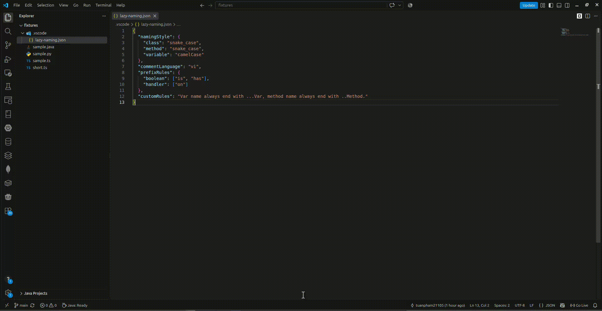

# Lazy Naming — VSCode Extension

**Lazy Naming** is a VSCode extension that uses GitHub Copilot to suggest meaningful names for your symbols and generate descriptive docstrings in JSDoc, Python docstring, or Javadoc format.


## Features

- **Suggest Rename** — Copilot proposes 3–6 candidate names (enforced to your configured naming style) and shows a Refactor Preview before anything touches disk.
- **Generate Description** — Copilot writes a docstring for a symbol, with `@param` / `@return` entries where applicable, inserted with the correct indentation above the declaration.
- **Two scopes** — act on a **selected symbol** (right-click in the editor) or on a **whole file** (Explorer context menu / Command Palette), picking multiple symbols at once.
- **Existing docstrings are replaced**, never duplicated.

## Requirements

- VSCode 1.95 or newer.
- The [GitHub Copilot](https://marketplace.visualstudio.com/items?itemName=GitHub.copilot) extension, installed and signed in.
- For whole-file symbol detection in languages without a built-in service (Python, Java, Go, …), install the matching language extension (e.g. `ms-python.python`) — see the configuration note below.

## Installation

This extension is **not on the VSCode Marketplace** — the author is too lazy to go through every step of the Microsoft publisher-account setup. Download the latest build from the repo's [Releases page](https://github.com/tuanpham21105/lazy-naming/releases) or the [builds](builds/) folder (e.g. `lazy-naming-1.0.0.vsix`) and install it:

```bash
code --install-extension lazy-naming-1.0.0.vsix
```

Contributors: press `F5` in this repo to run the Extension Development Host instead. See the [Developer Guide](docs/developer-guide.md) for setup, testing, and the (hopefully someday completed) Marketplace publishing steps.

## Usage

1. Open a file and **select a symbol** (a function, method, variable, or class).
2. Right-click and choose **Lazy Naming: Suggest Rename** or **Lazy Naming: Generate Description**.
3. Optionally type up to 200 characters of context and press Enter (press Enter to skip).
4. For **Suggest Rename**, pick one of the suggested candidate names.
5. Review the **Refactor Preview** and click **Apply** — nothing changes before you confirm.

To act on multiple symbols at once, right-click a **file in the Explorer** and choose either command, or run them from the Command Palette with no selection. Check the symbols to process and press Enter.

Escape at any step (context input, Quick Pick, or preview) leaves all files unchanged.

Demo:



## Configuration

Optionally put a `.vscode/lazy-naming.json` file in your workspace root to tune the AI:

```json
{
  "namingStyle": {
    "class": "PascalCase",
    "method": "camelCase",
    "variable": "snake_case"
  },
  "commentLanguage": "vi",
  "prefixRules": {
    "boolean": ["is", "has"],
    "handler": ["on"]
  },
  "customRules": "Use DDD terms such as Order and Customer."
}
```

| Field | Default | Meaning |
| --- | --- | --- |
| `namingStyle` | `{ class, method, variable } → camelCase` | Per-kind naming styles, one per key. A plain string (`"snake_case"`) applies to all kinds. Passed in the rename prompt, and suggestions that clearly violate the symbol's style are filtered out. |
| `commentLanguage` | `en` | The language generated docstrings are written in (e.g. `en`, `vi`). |
| `prefixRules` | `{}` | Role-based prefix rules for generated names. Keys are roles (`boolean`, `handler`, …); the AI infers the symbol's role from context and picks the matching prefix. |
| `customRules` | `""` | Free-text project conventions included in both prompts. |

**Language support note:** whole-file symbol detection and symbol-level rename need a language service. Built-in coverage exists for TypeScript/JavaScript, CSS, HTML, JSON, and Markdown. For other languages (Python, Java, Go, …) install the matching extension (e.g. `ms-python.python`). Lazy Naming warns you when one is missing.

## Commands

| Command | When it shows | Action |
| --- | --- | --- |
| `lazyNaming.suggestRename` | Text selected, or any non-folder file in Explorer | Suggest and apply a new name through Refactor Preview |
| `lazyNaming.generateDescription` | Text selected, or any non-folder file in Explorer | Generate and insert a docstring through Refactor Preview |

## Project Docs

- `docs/project_description.md` — product overview
- `docs/project_structure.md` — architecture and responsibilities
- `docs/development_plan.md` — phased development plan and testing guide
- `docs/developer-guide.md` — contributor setup, automated tests, manual verification, and release process

## Credits

<a href="https://www.flaticon.com/free-icons/sloth" title="sloth icons">Sloth icons created by Magnific - Flaticon</a> — used for the extension icon image above.
